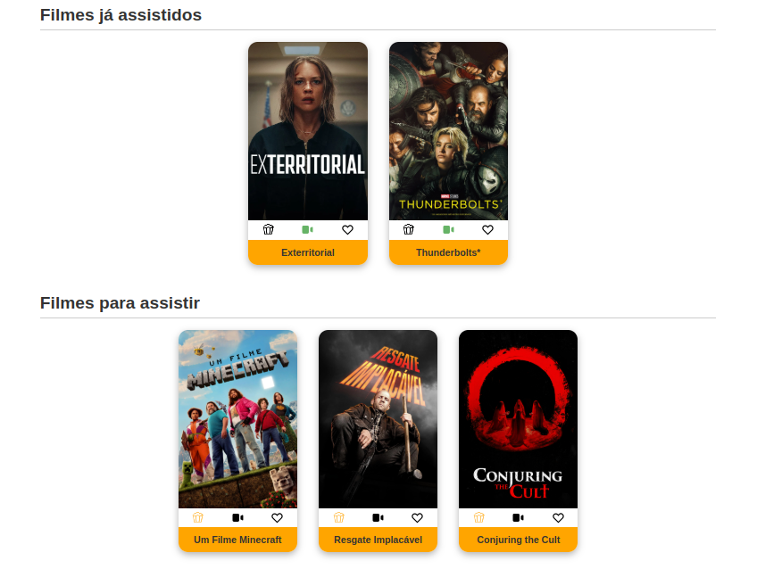
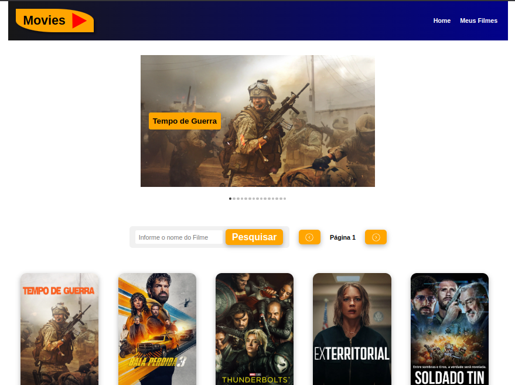
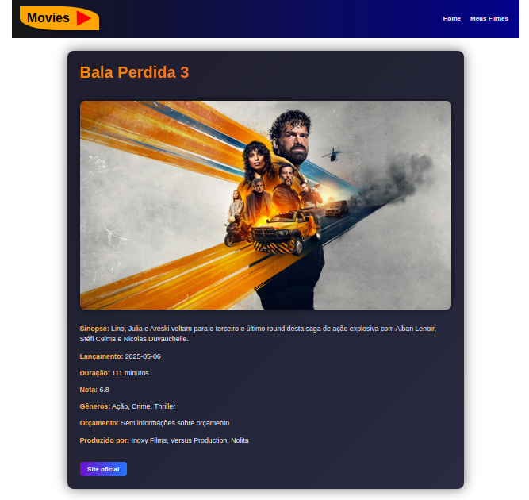

# 🎬 Catálogo de Filmes

Um aplicativo web que permite aos usuários explorar um catálogo de filmes, marcar filmes como "quero assistir" ou "assistido", visualizar detalhes e realizar buscas. Desenvolvido com **React**, usando **Context API**, **React Router**, e ícones com **React Icons**.

## [Visite o projeto](https://movies-ochre-gamma.vercel.app/)

- [linkedin](https://www.linkedin.com/in/renan-ferreira-desenvolvedor/)

## 📸 Preview

## 🚀 Funcionalidades

- 🎞️ Listagem de filmes com cards responsivos
- 🔍 Busca por nome do filme
- ⭐ Marcar filmes como "Quero Assistir"
- ✅ Marcar como "Assistido"
- 📄 Ver detalhes do filme (rota `/detalhes/:id`)
- ⏭️ Paginação para navegar entre as páginas de filmes
- 📱 Responsivo para telas pequenas (mobile-friendly)

## 🛠️ Tecnologias utilizadas

- [React](https://reactjs.org/)
- [React Router DOM](https://reactrouter.com/)
- [Context API](https://reactjs.org/docs/context.html)
- [React Icons](https://react-icons.github.io/react-icons/)
- CSS Modules

## 📦 API de Filmes

Os dados são obtidos a partir da API do TMDB

## ✨ Melhorias futuras

- Implementar autenticação de usuários
- Salvar dados em um backend (ex: Firebase, MongoDB)
- Adicionar favoritos

## [Visite o projeto](https://movies-ochre-gamma.vercel.app/)
